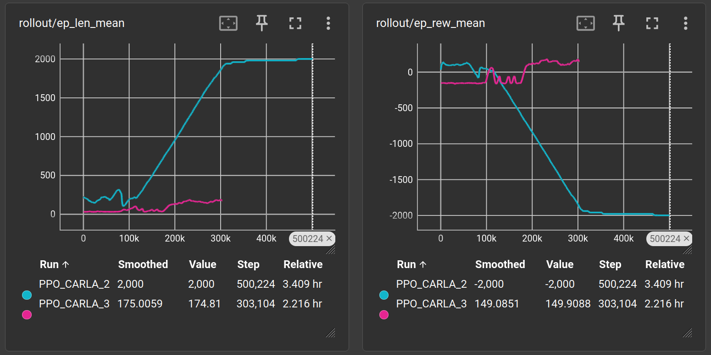

# Comparación de Funciones de Recompensa — CarlaEnv

Imagen de la derecha representa el tiempo del episodio. La imagen de la izquierda representa la recompensa por episodio.

## Primer modelo — 5 componentes

| Componente | Valor / Fórmula | Condición |
|---|---|---|
| **r_speed** | `1.0 × exp(-(speed - 40)² / 400)` | Siempre (gaussiana, nunca negativa) |
| **r_orientation** | `1.0 × max(0, dot_product)` | Siempre (sin umbral de velocidad) |
| **r_lane** | `-5.0` | Si hubo invasión de carril |
| **r_collision** | `-10.0` | Si colisionó → termina episodio |
| **r_offroad** | `-5.0` | Si está fuera del carril Driving |

**Fórmula total:** `r_speed + r_orientation + r_lane + r_collision + r_offroad`

---

## Segundo modelo — 7 componentes

| Componente | Valor / Fórmula | Condición |
|---|---|---|
| **r_speed** | `1.0 × exp(-(speed - 40)² / 400)` | Si `speed ≥ 2 km/h` (gaussiana) |
| **r_speed** (stall) | `-5.0` | Si `speed < 2 km/h` |
| **r_orientation** | `1.0 × max(0, dot_product)` | Solo si `speed > 5 km/h`, sino `0.0` |
| **r_progress** | `1.0 × min(distancia_recorrida, 5.0)` | Distancia entre frames, capeada a 5m |
| **r_lane** | `-5.0` | Si hubo invasión de carril |
| **r_collision** | `-10.0` | Si colisionó → termina episodio |
| **r_offroad** | `-5.0` | Si está fuera del carril Driving |
| **r_stall** | `-3.0` | Si lleva ≥30 steps parado → termina episodio |

**Fórmula total:** `r_speed + r_orientation + r_progress + r_lane + r_collision + r_offroad + r_stall`

---

## Constantes compartidas

| Parámetro | Valor |
|---|---|
| TARGET_SPEED_KMH | 40 km/h |
| MAX_STEPS | 2000 (100s simulados) |
| FIXED_DELTA | 0.05s (20 FPS simulados) |
| Acciones discretas | 9 combinaciones (steer ±0.3, throttle 0.6/1.0, brake 0.5) |

---

## Diferencias entre versiones

### 1. Penalidad por quietud (r_speed cuando speed < 2 km/h)

Penaliza al actor con -5 si se queda quieto, o con velocidad < 2 km/h

### 2. r_progress (En V2)

Recompensa proporcional a la distancia real avanzada entre frames. incentiva el desplazamiento hacia adelante

### 3. r_orientation condicionada a velocidad

Evita que el agente reciba recompensa por "mirar en la dirección correcta" sin moverse.

### 4. r_stall — corte por inactividad

Si el agente acumula ≥30 steps consecutivos con `speed < 2 km/h`, el episodio termina con una penalidad adicional de `-3.0`. Esto fuerza al agente a moverse o pierde el episodio.

### 5. Logging CSV

V2 loguea `r_progress` y `r_stall` como columnas adicionales en el CSV. En V1 solo se registran 5 componentes.

# Conclusiones

Sabiendo que con MAX_STEPS = 2000 y asumiendo el caso ideal sin colisión ni truncado temprano:
v1 — Máximo teórico por episodio: 2.0 × 2000 = 4000
v2 — Máximo teórico por episodio: 7.0 × 2000 = 14000
v2 — Máximo realista por episodio: 2.56 × 2000 ≈ 5120

Se determina entonces que el modelo V1 es inferior y estan mal determinadas las recompensas, ya que al terminar el entrenamiento, el ultimo episodio termino con recompensa negativa. Observando en CARLA se veia el vehiculo parado, ya que de esta forma se evitaba el castigo que le daba una colision.
El modelo v2 es mas robusto sin embargo aun esta lejos de la recompensa maxima realista por episodio, lo que sugiere que le falta aprendizaje al modelo.